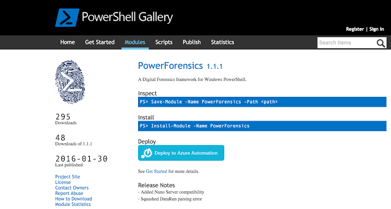
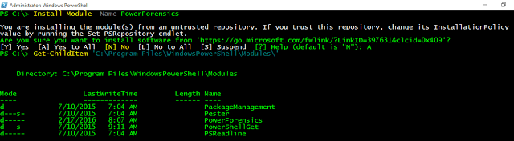
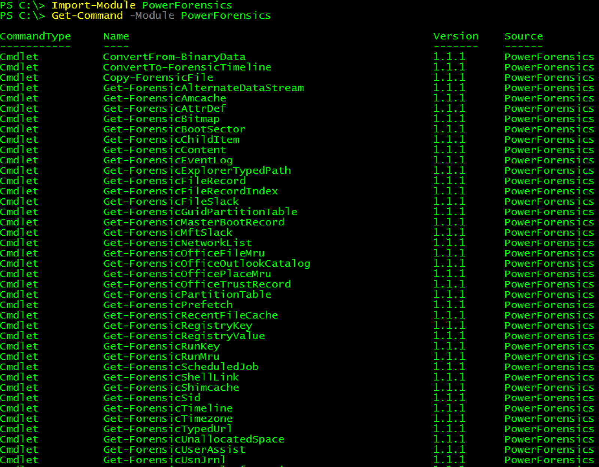
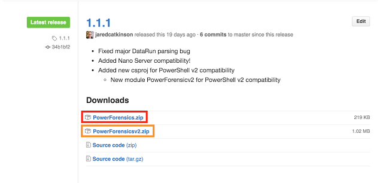
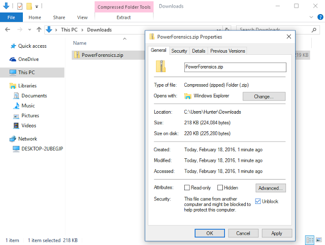
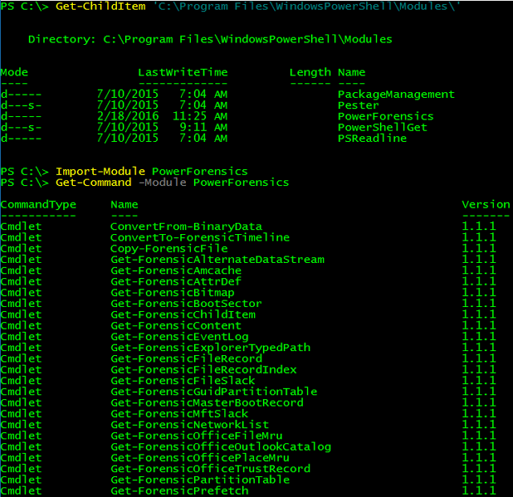

# Installing PowerForensics
This page provides walkthroughs of installing PowerForensics from either the PowerShell Gallery or Github and why you would choose one method over the other.

## Method 1: PowerShell Gallery
By far, the easiest way to install a PowerShell module is from the PowerShell Gallery. For anyone unfamiliar with the PowerShell Gallery, is described as "the central repository for PowerShell content" meaning PowerShell community members can host their code (modules, DSC resources, and scripts) on the Gallery. The major caveat with PowerShell Gallery is that the necessary cmdlets are only available in Window Management Framework (WMF) 5.

The image below shows the PowerForensics project page which includes details about the module such as the current version, release notes, and installation instructions.

To locate a module from the command line, use the Find-Module cmdlet with a keyword. In the example below, I search for any module whose name contains the word "Forensic". This query shows me that there are two modules PowerForensics and PowerForensicsv2 (PowerForensicsv2 is the PowerShell v2 compliant version of PowerForensics). 

Once you have located the desired package, use Install-Module to download and install it (notice that I used the command from the Install section of the PowerShell Gallery project page). Install-Module will prompt you to make sure you know that you are downloading a module from the internet to which you should select "A". By default, the module will be installed in the %ProgramFiles%\WindowsPowerShell\Modules directory, which makes it available for all users. If you want the module to be accessible to only the current user  you can specify -Scope CurrentUser with Install-Module and it will be installed in the %UserProfile%\Documents\WindowsPowerShell\Modules directory.

Once PowerForensics is installed, we can use Import-Module to load the module into our current session and Get-Command, with the -Module parameter, to list the cmdlets exposed by the module.

## Method 2: Github
Github is a popular code distribution site and also another way to download PowerForensics. Each major release contains three zip files; PowerForensics.zip, PowerForensicsv2.zip, and Source code. (Same as above, PowerForensicsv2 is the PowerShell v2.0 compliant version)
 

If you downloaded PowerForensics with Internet Explorer, you must “Unblock” the files. This can be accomplished by right clicking on the file and selecting properties. From the properties menu, check the Unblock box and click Apply. 

 This step is necessary because Internet Explorer adds an Alternate Data Stream (ADS) named Zone.Identifier to all files downloaded through the browser. The Zone.Identifier indicates what security zone the file was downloaded from. PowerShell requires user interaction for all files downloaded from the internet, so unblocking allows us to skip this tedious step.

To finish installing PowerForensics, unzip the module into a directory in the PSModulePath like C:\Program Files\WindowsPowerShell\Modules\ import and go! For more information about PSModulePath check out this article.

 You are now ready to use the PowerForensics PowerShell module! Subscribe to Invoke-IR to make sure you get the latest PowerForensics tricks and tips.